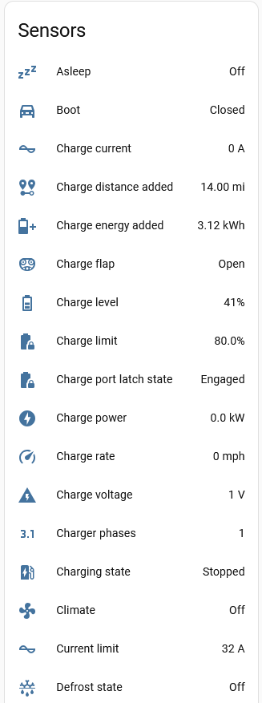
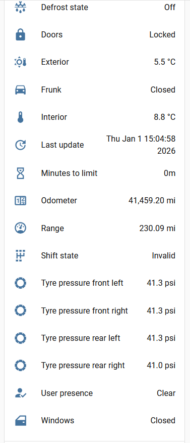

# ESPHome Tesla BLE

[![GitHub Release][releases-shield]][releases]
[![GitHub Activity][commits-shield]][commits]
[![Last Commit][last-commit-shield]][commits]
[![Platform][platform-shield]](https://github.com/esphome)

This project [PedroKTFC/esphome-tesla-ble](https://github.com/PedroKTFC/esphome-tesla-ble) lets you use an ESP32 device to manage charging a Tesla vehicle over BLE. It is a fork of the [yoziru/esphome-tesla-ble](http://github.com/yoziru/esphome-tesla-ble) and uses a similar fork of the [yoziru/tesla-ble](http://github.com/yoziru/tesla-ble) library.

| Controls | Sensors-1 | Sensors-2| Diagnostic |
| - | - | - | - |
|  |  |  |  |

## If it doesn't build

I've put this section at the start because it seems people don't always read all the way to the end! So please read this section at least.
> [!TIP]
> **Always** start from the example yaml [`tesla-ble-example.yml`](./tesla-ble.example.yml). This has been tested many times and should work in almost every case.

If the build fails, try the following (assuming you're building using the Home Assistant ESPHome builder):
- In the ESPHome builder UI, clean the build files (as shown in the image below) and try installing again. If that doesn't work, try the next step.

&nbsp;&nbsp;&nbsp;&nbsp;&nbsp;&nbsp; 

- Again in the ESPHome builder UI, click on the CLEAN ALL option and try installing again (as shown in the image below). If that still doesn't work, try the next step.

&nbsp;&nbsp;&nbsp;&nbsp;&nbsp;&nbsp; 

- Uninstall and install the ESPHome add-on and try installing again.

&nbsp;&nbsp;&nbsp;&nbsp;&nbsp;&nbsp; 

> [!TIP]
> If these don't work, raise an issue and include a copy of your yaml and that part of your log that shows the error and I'll try to work out what's going wrong. (If you don't provide these, I'm afraid I'll simply ask you for them in the issue, I can't help without any information.)

## Features

### Controls

These are implemented as switches, covers, buttons or numbers. Where indicated, these use the current sensor value for the control (but be aware that changing a value/state has a delay before it is reflected in the corresponding sensor - it takes time to send the messages to the vehicle to make the control and then read back the new value - it might look like the control has been rejected as the value reverts to the previous value; be patient!).

- Open/close boot (cover)
- Open/close charge port flap. Uses current sensor value (cover)
- Turn on/off charger (switch)
- Set charging amps (number)
- Set charging limit (%).  Uses current sensor value (number)
- Turn on/off climate. Uses current sensor value (switch)
- Turn on/off defrost. Uses current sensor value (switch)
- Flash lights (button)
- Open frunk. Open only (cover)
- Lock/unlock the car (lock)
- Turn on/off sentry mode
- Sound horn (button)
- Turn on/off steering wheel heater (switch)
- Unlatch driver door (button). This is disabled by default as it cannot be undone (eg if you're on holiday and, say your car is on your drive, if you accidentally action this button your driver door will unlatch and you can only re-close it physically!) 
- Unlock charge port (button)
- Vent/close windows (cover)
- Wake up vehicle (button)

### Vehicle Information Sensors

There are two categories, those available even when asleep and those only when awake.

- Always available:
  - Asleep/awake
  - Doors locked/unlocked
  - User present/not present
- Only when awake:
  - Boot state open/closed
  - Charge current (Amps)
  - Charge distance added (miles)
  - Charge energy added (kWh)
  - Charging flap open/closed
  - Charge level (%)
  - Charge limit (%)
  - Charge power (kW)
  - Charge voltage (V)
  - Charging state (eg Stopped, Charging, Complete)
  - Climate on/off
  - Current limit setting (Amps)
  - Defrost state on/off
  - Doors locked/unlocked
  - Exterior temperature (°C)
  - Frunk open/closed
  - Interior temperature (°C)
  - Last update (the last time a response was received from the Infotainment system, does not go "Unknown" once a response has been received)
  - Minutes to limit (time to charge limit, multiples of 5 minutes)
  - Odometer (miles)
  - Range (miles)
  - Shift state (eg Invalid, R, N, D)
  - Windows open/closed

### Diagnostics

These are the diagnostic button actions:

- Force data update (wakes the car and reads all sensors)
- Pair BLE key with vehicle
- Regenerate key - will require repairing
- Restart ESP board

### Configuration

There are five number and two switch actions that allow the dynamic update of the polling parameters (see below). These are disabled by default as I recommend they should be changed through yaml but they are useful for tuning/debugging your setup. Note there is no equivalent to the `update_interval` parameter - this can still only be updated through yaml (and so a re-build). The following lists them with the equivalent polling parameter:

- Post wake poll time = post_wake_poll_time (number)
- Poll data period = poll_data_period (number)
- Poll asleep period = poll_asleep_period (number)
- Poll charging period = poll_charging_period (number)
- BLE disconnected min time = ble_disconnected_min_time (number)
- Fast poll if unlocked = fast_poll_if_unlocked (switch)
- Wake on boot = wake_on_boot (switch)

## Hardware

- ESP32
- [M5Stack Atom S3](https://docs.m5stack.com/en/core/AtomS3)
- Alternatively, [M5Stack Atom S3-Lite](https://docs.m5stack.com/en/core/AtomS3%20Lite)
- Alternatively, [M5Stack Nano C6](https://docs.m5stack.com/en/core/M5NanoC6)
- USB-C cable to flash conveniently the M5Stack of your choice

## Usage

### Vehicle data polling

There are several key parameters that determine the polling activity as follows:

| Name | Type | Default | Supported options | Description |
| --- | --- | --- | --- | --- |
|`update_interval`|number|10s|any interval|This is the base polling rate in seconds. **No other polls can happen faster than this even if you configure them shorter.** The base polling checks the overall status using the car’s VCSEC system (Vehicle Controller and Safety Electronics Controller, the central electronic control unit of a Tesla vehicle). It is polled at this rate and does not wake the car when asleep or prevent the car from going to sleep.|
|`post_wake_poll_time`|number|300|>0 seconds|If the vehicle wakes up, it will be detected and the vehicle will be polled for data at a rate specified in `poll_data_period` for at least this number of seconds. After this, polling will fallback to a rate specified in `poll_asleep_period`. E.g. Suppose `post_wake_poll_time`=300, `poll_data_period`=60 and `poll_asleep_period`=120. In this case, when the care awakes, initially data will be polled each 60s for the first 300s. Then polling will continue each 120s.|
|`poll_data_period`|number|60|>0 seconds|The vehicle is polled every this parameter seconds after becoming awake for a period of `post_wake_poll_time` seconds. Note the vehicle can stay awake if this is set too short.|
|`poll_asleep_period`|number|60|>0 seconds|The vehicle is polled every this parameter seconds while being asleep and beyond the `post_wake_poll_time` after awakening. If set too short it can prevent the vehicle falling asleep.|
|`poll_charging_period`|number|10|>0 seconds|While charging, the car can be polled more frequently if desired using this parameter.|
|`ble_disconnected_min_time`|number|300|>0 seconds|Sensors will only be set to *Unknown* if the BLE connection remains disconnected for at least this time (useful if you have a slightly flakey BLE connection to your vehicle). Setting it to zero means sensors will be set to *Unknown* as soon as the BLE connection disconnects.|
|`fast_poll_if_unlocked`|number|0|0, >0|Controls whether fast polls are enabled when unlocked. If the vehicle is unlocked (and `fast_poll_if_unlocked` > 0) or a person is detected as present in the vehicle, the vehicle will be polled at `update_interval` until it is locked and/or no person is present in the vehicle. This could be useful if you wish to quickly detect a change in the vehicle (for example, I use it to detect when it is put into gear so I can trigger an automation to open my electric gate). Set to 0 to disable, any value > 0 to enable.|
|`wake_on_boot`|number|0|0, >0|Controls whether the car is woken when the board restarts. Set to 0 to not wake, any value > 0 to wake.|

Note that if the other parameters are not multiples of `update_interval`, the timings will be longer than expected. For example, if `update_interval` is set to 30s and `poll_data_period` is set to 75s, then the effective `poll_data_period` will be 90s.

## Miles vs Km

By default the car reports miles, so this integration returns miles. In home assistant you can edit the sensor and select the preferred unit of measurement there.

## Pre-requisites

**Recommended path**
- Home Assistant [Add-On Esphome Device Builder](https://esphome.io/guides/getting_started_hassio#installing-esphome-device-builder)

**Alternative**
- Python 3.10+
- GNU Make

## Finding the BLE MAC address of your vehicle

**Recommended path**

Use an appropriate BLE app on your phone (eg BLE Scanner) to scan for the BLE devices nearby (so be close to your car). You should see your car in the list of devices (its name will begin with an 'S') with the MAC address displayed.
Copy and rename `secrets.yaml.example` to `secrets.yaml` and update it with your WiFi credentials (`wifi_ssid` and `wifi_password`) and vehicle VIN (`tesla_vin`) and BLE MAC adress (`ble_mac_address`).

**Alternative**

Build the scanner in the [`ble-scanner.yml`](./ble-scanner.yml) file. Once built, it will start scanning and print out the MAC address of any Tesla vehicles found in the logs. Building does take some time.

The following is the original method. I have never tried this and I do not maintain the associated file. I therefore do not recommend this but have left it here in case there are any people left who still use it.

1. Copy and rename `secrets.yaml.example` to `secrets.yaml` and update it with your WiFi credentials (`wifi_ssid` and `wifi_password`) and vehicle VIN (`tesla_vin`).
1. Enable the `tesla_ble_listener` package in `packages/base.yml` by uncommenting the `listener: !include listener.yml` line.
1. Build and flash the firmware to your ESP32 device. See the 'Building and flashing ESP32 firmware' section below.
1. Open the ESPHome logs in Home Assistant and wake it up. Watch for the "Found Tesla vehicle" message, which will contain the BLE MAC address of your vehicle.
    > Note: The vehicle must be in range and awake for the BLE MAC address to be discovered. If the vehicle is not awake, open the Tesla app and run any command

    ```log
    [00:00:00][D][tesla_ble_listener:044]: Parsing device: [CC:BB:D1:E2:34:F0]: BLE Device name 1
    [00:00:00][D][tesla_ble_listener:044]: Parsing device: [19:8A:BB:C3:D2:1F]: 
    [00:00:00][D][tesla_ble_listener:044]: Parsing device: [19:8A:BB:C3:D2:1F]:
    [00:00:00][D][tesla_ble_listener:044]: Parsing device: [F5:4E:3D:C2:1B:A0]: BLE Device name 2
    [00:00:00][D][tesla_ble_listener:044]: Parsing device: [A0:B1:C2:D3:E4:F5]: S1a87a5a75f3df858C
    [00:00:00][I][tesla_ble_listener:054]: Found Tesla vehicle | Name: S1a87a5a75f3df858C | MAC: A0:B1:C2:D3:E4:F5
    ```

1. Clean up your environment before the next step by disabling the `tesla_ble_listener` package in `packages/base.yml` and running

    ```sh
    make clean
    ```

## Building and flashing ESP32 firmware

**Recommended path**

For an example ESPHome dashboard, see [`tesla-ble-example.yml`](./tesla-ble.example.yml). Please always start from this. I strongly recommend building this using the ESPHome Device Builder add-on in Home Assistant as this makes building and re-building (eg for updates) much easier.
If you have limited experience with flashing ESP32 devices and want to get more familiar, check Lazy Tech Geek's video https://www.youtube.com/watch?v=XMpNJgozF-c

**Alternative**

The following are instructions if you use `make`. I have never used these so cannot vouch for their accuracy (as I said above, it's far easier to use the ESPHome Device Builder add-on in Home Assistant). I welcome any feedback on improving/correcting these instructions - please raise an issue for it.

1. Connect your ESP32 device to your computer via USB
1. Copy and rename `secrets.yaml.example` to `secrets.yaml` and update it with your WiFi credentials (`wifi_ssid` and `wifi_password`) and vehicle details (`ble_mac_address` and `tesla_vin`)
1. Build the image with [ESPHome](https://esphome.io/guides/getting_started_command_line.html). Alternate boards are listed in the `boards/` directory.

    ```sh
    make compile BOARD=m5stack-nanoc6
    ```

1. Upload/flash the firmware to the board.

    ```sh
    make upload BOARD=m5stack-nanoc6
    ```

1. After flashing, you can use the log command to monitor the logs from the device. The host suffix is the last part of the device name in the ESPHome dashboard (e.g. `5b2ac7`).

    ```sh
    make logs HOST_SUFFIX=-5b2ac7
    ```

1. For updating your device, you can OTA update over local WiFi using the same host suffix:

    ```sh
    make upload HOST_SUFFIX=-5b2ac7
    ```

> Note: the make commands are just a wrapper around the `esphome` command. You can also use the `esphome` commands directly if you prefer (e.g. `esphome compile tesla-ble-m5stack-nanoc6.yml`)

## Adding the device to Home Assistant

1. In Home Assistant, go to Settings > Devices & Services. If your device is discovered automatically, you can add it by clicking the "Configure" button by the discovered device. If not, click the "+ Add integration" button and select "ESPHome" as the integration and enter the IP address of your device.
2. Enter the API encryption key from the `secrets.yaml` file when prompted.
3. That's it! You should now see the device in Home Assistant and be able to control it.

## Pairing the BLE key with your vehicle

1. Make sure your ESP32 device is close to the car (check the "BLE Signal" sensor) and the BLE MAC address and VIN in `secrets.yaml` is correct. IT IS ESSENTIAL THESE ARE CORRECT - YOUR CAR WILL NOT PAIR OTHERWISE.
1. Get into your vehicle
1. In Home Assistant, go to Settings > Devices & Services > ESPHome, choose your Tesla BLE device and click "Pair BLE key"
1. Tap your NFC card to your car's center console
1. A prompt will appear on the screen of your car asking if you want to pair the key
    > Note: if the popup does not appear, you may need to press "Pair BLE key" and tap your card again

    

1. Hit confirm on the screen
1. To verify the key was added, tap Controls > Locks, and you should see a new key named "Unknown device" in the list
1. [optional] Rename your key to "ESPHome BLE" to make it easier to identify

    

[commits-shield]: https://img.shields.io/github/commit-activity/y/PedroKTFC/esphome-tesla-ble
[commits]: https://github.com/PedroKTFC/esphome-tesla-ble/commits/main
[releases-shield]: https://img.shields.io/github/v/release/PedroKTFC/esphome-tesla-ble
[releases]: https://github.com/Blackymas/PedroKTFC/esphome-tesla-ble
[last-commit-shield]: https://img.shields.io/github/last-commit/PedroKTFC/esphome-tesla-ble
[platform-shield]: https://img.shields.io/badge/platform-Home%20Assistant%20&%20ESPHome-blue


