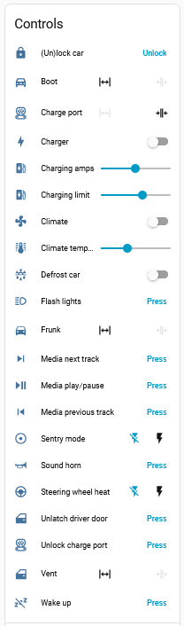
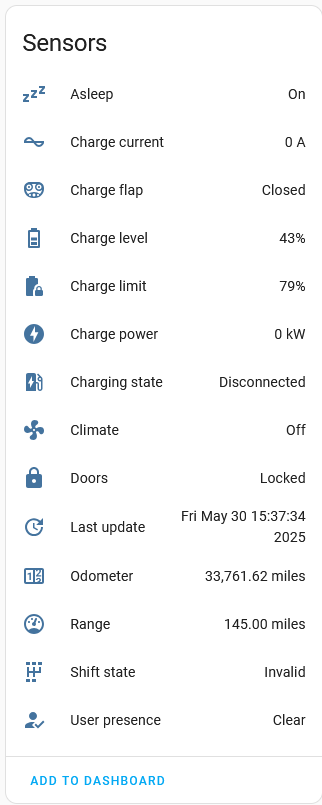
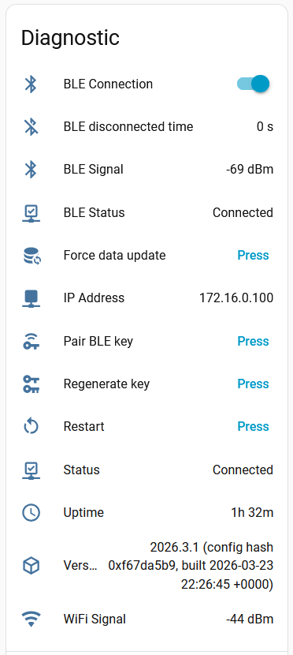

# ESPHome Tesla BLE

This project lets you use an ESP32 device to manage charging a Tesla vehicle over BLE. It is a fork of the [yoziru/esphome-tesla-ble](http://github.com/yoziru/esphome-tesla-ble) and the [yoziru/tesla-ble](http://github.com/yoziru/tesla-ble) library.

| Controls | Sensors | Diagnostic |
| - | - | - |
|  |  |  |


## Features
- Controls. These are iplemented as switches, covers, buttons or numbers. Where indicated, these use the current sensor value for the control (but be aware that changing a value/state has a delay before it is reflected in the corresponding sensor - it takes time to send the messages to the vehicle to make the control and then read back the new value - it might look like the control has been rejected as the value reverts to the previous value; be patient!).
   - Open/close boot (cover)
   - Open/close charge port flap. Uses current sensor value (cover)
   - Turn on/off charger (switch)
   - Set charging amps (number)
   - Set charging limit (%).  Uses current sensor value (number)
   - Turn on/off climate. Uses current sensor value (switch)
   - Turn on/off defrost. Uses current sensor value (switch)
   - Flash lights (button)
   - Open frunk. Open only (cover)
   - Turn on/off sentry mode
   - Sound horn (button)
   - Turn on/off steering wheel heater (switch)
   - Unlock charge port (button)
   - Vent/close windows (cover)
   - Wake up vehicle (button)
- Vehicle information sensors. There are two categories, those available even when asleep and those only when awake. Always available:
  - Asleep/awake
  - Doors locked/unlocked
  - User present/not present
- Only when awake:
  - Boot state open/closed
  - Charge current (Amps)
  - Charging flap open/closed
  - Charge level (%)
  - Charge limit (%)
  - Charge power (kW)
  - Charging state (eg Stopped, Charging)
  - Climate on/off
  - Current limit setting (Amps)
  - Defrost state on/off
  - Exterior temperature (°C)
  - Frunk open/closed
  - Interior temperature (°C)
  - Last update (the last time a response was received from the Infotainment system, dows not go "Unknown" once a response has been received)
  - Odometer (miles)
  - Range (miles)
  - Shift state (eg Invalid, R, N, D)
- Diagnostics (button actions)
   - Force data update (wakes the car and reads all sensors)
   - Pair BLE key with vehicle
   - Restart ESP board

## Usage

For an example ESPHome dashboard, see [`tesla-ble-example.yml`](./tesla-ble.example.yml). There are several key parameters that determine the polling activity as follows:

- **update_interval**: This is the base polling rate. **No other polls can happen faster than this even if you configure them shorter.** The VCSEC system is polled at this rate and does not wake the car. [Default 10s]
- **post_wake_poll_time**: If the vehicle wakes up, it will be detected and the vehicle polled for data for at least this time [Default 300s]
- **poll_data_period**: The vehicle is polled every this paramter seconds when awake. Note the vehicle can stay awake if this is set too short [Default 60s]
- **poll_asleep_period**: It is possible that the vehicle starts, stops and restarts charging while always awake. In this case it is likely that the restart is not detected. Therefore the vehicle is ALWAYS polled at this rate even when asleep. If set too short it can prevent the vehicle falling asleep. [Default 60s]
- **poll_charging_period**: while charging, the car can be polled more frequently if desired using this parameter [Default 10s]
- **ble_disconnected_min_time**: sensors will only be set to *Unknown* if the BLE connection is disconnected continuously for at least this time (useful if you have a slightly flakey BLE connection to your vehicle). Setting it to zero means sensors will be set to *Unknown* as soon as the BLE connection disconnects. [Default 300s]
- **fast_poll_if_unlocked**: controls whether fast polls are enabled when unlocked, set to 0 to disable, any value > 0 to enable [Default 1 and so enabled]


If the vehicle is unlocked (and fast_poll_if_unlocked > 0) or a person is detected as present in the vehicle, the vehicle will be polled at *update_interval* until it is locked and/or no person is present in the vehicle. This could be useful if you wish to quickly detect a change in the vehicle (for example, I use it to detect when it is put into gear so I can trigger an automation to open my electric gate).

Note that if the other parameters are not multiples of *update_interval*, the timings will be longer than expected. For example, if *update_interval* is set to 30s and *poll_data_period* is set to 75s, then the effective *poll_data_period* will be 90s.

## Miles vs Km

By default the car reports miles, so this integration returns miles. In home assistant you can edit the sensor and select the prefered unit of measurement there.

### Pre-requisites
- Python 3.10+
- GNU Make

### Finding the BLE MAC address of your vehicle

1. Copy and rename `secrets.yaml.example` to `secrets.yaml` and update it with your WiFi credentials (`wifi_ssid` and `wifi_password`) and vehicle VIN (`tesla_vin`).
1. Enable the `tesla_ble_listener` package in `packages/base.yml` by uncommenting the `listener: !include listener.yml` line.
1. Build and flash the firmware to your ESP32 device. See the 'Building and flashing ESP32 firmware' section below.
1. Open the ESPHome logs in Home Assistant and wake it up. Watch for the "Found Tesla vehicle" message, which will contain the BLE MAC address of your vehicle.
    > Note: The vehicle must be in range and awake for the BLE MAC address to be discovered. If the vehicle is not awake, open the Tesla app and run any command
    ```log
    [00:00:00][D][tesla_ble_listener:044]: Parsing device: [CC:BB:D1:E2:34:F0]: BLE Device name 1
    [00:00:00][D][tesla_ble_listener:044]: Parsing device: [19:8A:BB:C3:D2:1F]: 
    [00:00:00][D][tesla_ble_listener:044]: Parsing device: [19:8A:BB:C3:D2:1F]:
    [00:00:00][D][tesla_ble_listener:044]: Parsing device: [F5:4E:3D:C2:1B:A0]: BLE Device name 2
    [00:00:00][D][tesla_ble_listener:044]: Parsing device: [A0:B1:C2:D3:E4:F5]: S1a87a5a75f3df858C
    [00:00:00][I][tesla_ble_listener:054]: Found Tesla vehicle | Name: S1a87a5a75f3df858C | MAC: A0:B1:C2:D3:E4:F5
    ```
1. Clean up your environment before the next step by disabling the `tesla_ble_listener` package in `packages/base.yml` and running
    ```sh
    make clean
    ```

### Building and flashing ESP32 firmware
1. Connect your ESP32 device to your computer via USB
1. Copy and rename `secrets.yaml.example` to `secrets.yaml` and update it with your WiFi credentials (`wifi_ssid` and `wifi_password`) and vehicle details (`ble_mac_address` and `tesla_vin`)
1. Build the image with [ESPHome](https://esphome.io/guides/getting_started_command_line.html). Alternate boards are listed in the `boards/` directory.

    ```sh
    make compile BOARD=m5stack-nanoc6
    ```

1. Upload/flash the firmware to the board.

    ```sh
    make upload BOARD=m5stack-nanoc6
    ```

1. After flashing, you can use the log command to monitor the logs from the device. The host suffix is the last part of the device name in the ESPHome dashboard (e.g. `5b2ac7`).
    ```sh
    make logs HOST_SUFFIX=-5b2ac7
    ```

1. For updating your device, you can OTA update over local WiFi using the same host suffix:
    ```sh
    make upload HOST_SUFFIX=-5b2ac7
    ```

> Note: the make commands are just a wrapper around the `esphome` command. You can also use the `esphome` commands directly if you prefer (e.g. `esphome compile tesla-ble-m5stack-nanoc6.yml`)

### Adding the device to Home Assistant

1. In Home Assistant, go to Settings > Devices & Services. If your device is discovered automatically, you can add it by clicking the "Configure" button by the discovered device. If not, click the "+ Add integration" button and select "ESPHome" as the integration and enter the IP address of your device.
2. Enter the API encryption key from the `secrets.yaml` file when prompted.
3. That's it! You should now see the device in Home Assistant and be able to control it.


### Pairing the BLE key with your vehicle
1. Make sure your ESP32 device is close to the car (check the "BLE Signal" sensor) and the BLE MAC address and VIN in `secrets.yaml` is correct.
1. Get into your vehicle
1. In Home Assistant, go to Settings > Devices & Services > ESPHome, choose your Tesla BLE device and click "Pair BLE key"
1. Tap your NFC card to your car's center console
1. A prompt will appear on the screen of your car asking if you want to pair the key
    > Note: if the popup does not appear, you may need to press "Pair BLE key" and tap your card again

    
1. Hit confirm on the screen
1. To verify the key was added, tap Controls > Locks, and you should see a new key named "Unknown device" in the list
1. [optional] Rename your key to "ESPHome BLE" to make it easier to identify
    
